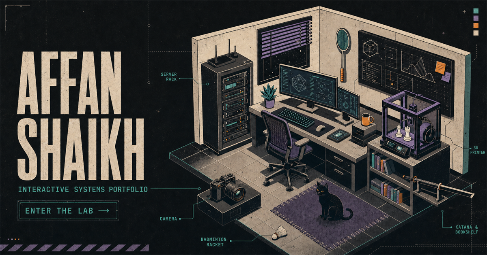

# Affan Shaikh Interactive Portfolio

An interactive Three.js portfolio for Affan Shaikh, a Networking and IT Security student at Ontario Tech University.

[Open the live portfolio](https://affan-shaikh-portfolio.sil6428-archtech.workers.dev)



## Experience

The homepage is a full-screen cyber-lab diorama. Visitors inspect highlighted objects, move through eased camera transitions, and open the portfolio's content without leaving the room. The computer boots into AFFAN_OS, a simulated desktop with a file manager, terminal, resume viewer, project files, contact links, and month-organized learning logs.

Normal HTML routes remain available for direct links and accessible reading:

- `/info`
- `/interests`
- `/work/archtech`
- `/work/ssik`
- `/interests/badminton`
- `/interests/3d-printing`
- `/interests/reading`
- `/interests/photography`
- `/interests/home-lab`

## Engineering highlights

- Procedural Three.js room, workstation, server rack, 3D printer, chess set, racket, bookshelf, katana, and animated black cat
- Licensed local CC0 camera model documented in [`THIRD_PARTY_ASSETS.md`](THIRD_PARTY_ASSETS.md)
- Whole-object raycast highlighting, keyboard access, touch controls, reduced-motion support, and direct route fallbacks
- Adaptive render tiers, bounded shadows, throttled reflections, idle frame limiting, and hidden-tab suspension
- AFFAN_OS desktop with folders, windows, search, terminal commands, resume viewing, and synchronized learning logs
- Deterministic three-minute chess-set print animation and small room Easter eggs
- Production deployment on Cloudflare Workers
- Automated rendered-route and public-content checks

The detailed build history is in [`CHANGELOG.md`](CHANGELOG.md).

## Technology

- TypeScript, React 19, Three.js, Vinext, Vite 8
- Cloudflare Workers and the Cloudflare Vite plugin
- ESLint and the Node.js test runner

## Local development

Node.js 22.13 or newer is required.

```bash
git clone https://github.com/sil6428/affan-portfolio.git
cd affan-portfolio
npm install
npm run dev
```

Quality checks:

```bash
npm run lint
npm test
```

`npm test` creates a production build and validates the main routes, metadata, public wording, links, and key interaction hooks.

## Content notes

- Archtech work covers Google Workspace, website-team coordination, hosting, and deployment for a developing nonprofit. Its source and internal work remain private.
- SSIK IT Consulting & Solutions was co-founded with Ghayas Sher. We share service planning, security-control research, privacy research, and stakeholder communication. I independently built and maintain its public website and completed a private, local-first internal intelligence platform with passive collection, evidence review, role-based access, bounded automation, recovery controls, and 79 automated tests. The private source is intentionally not linked.
- The public portfolio and public resume do not expose a phone number. Application-specific resume copies retain it.

## References and assets

The interaction system was informed by [Ida's Gameboy](https://idas-gameboy.netlify.app/), [Jesse Zhou's portfolio](https://www.jesse-zhou.com/), [Bruno Simon's portfolio](https://bruno-simon.com/), [React Bits](https://reactbits.dev/get-started/introduction), Rachel Wei's [portfolio](https://rachelqrwei.ca/use) and [repository](https://github.com/rachelqrwei/personalwebsite), and the official [Three.js documentation](https://threejs.org/). The implementation, room, interface, copy, and custom models are original. No source or assets were copied from projects without a compatible licence.

See [`DESIGN_REFERENCES.md`](DESIGN_REFERENCES.md), [`THIRD_PARTY_ASSETS.md`](THIRD_PARTY_ASSETS.md), and [`SOUND_EFFECTS.md`](SOUND_EFFECTS.md) for complete attribution.

## License

Copyright © 2026 Affan Shaikh. All rights reserved. The source is public for portfolio review. Reuse, redistribution, modification, or publication requires prior written permission. See [`LICENSE`](LICENSE).
